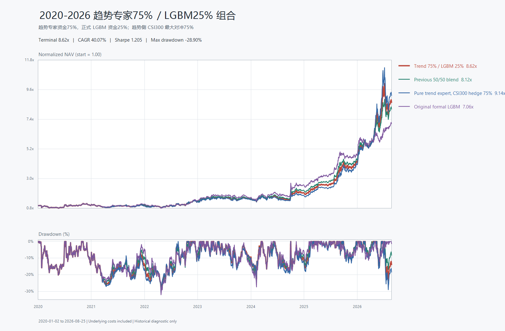

# A-share 75/25 Independent-Sleeve Paper Monitor

一套可运行的 A 股日频选股、次日开盘模拟成交和网站监控系统。当前正式前向模拟协议由两个独立资金袖套组成：

- 75% 初始资金：半导体设备趋势专家 Top5，叠加 CSI300 MA120 动态对冲，最高对冲 75%。
- 25% 初始资金：冻结的 75/25 Alpha158-Barra LightGBM Top5，不做指数对冲。
- 两个袖套分别复利，不做日频跨袖套再平衡，也不收取不存在的资金搬移成本。
- T 日收盘生成信号，T+1 交易日开盘模拟成交；Top5、10 个交易日主调仓、单边 12bp 股票成本、100 股整数手。



## Status

这是前向模拟盘和研究代码，不连接券商，不自动提交真实订单，也不构成投资建议。

新账户从 2026-08-26 之后开始记录，网站和收益曲线不会回填 2020-2026 的历史回测。历史区间已经被反复用于策略比较，只能解释选择依据，不能作为新样本外证据。

2020-01-02 至 2026-08-25 的历史诊断：

| Strategy | CAGR | Sharpe | Max drawdown |
|---|---:|---:|---:|
| 75% trend expert + 25% formal LGBM, independent sleeves | 40.07% | 1.205 | -28.90% |
| Formal 75/25 Alpha158-Barra LGBM | 35.76% | 1.106 | -32.07% |
| DRL allocator v3 | 37.73% | 1.188 | -30.06% |

上述结果使用当前冻结 Top50 历史回填和当前版本复权数据，存在成分股、存续和 point-in-time 偏差。正式判断需要至少 126 个交易日的未改参数前向模拟。

## Strategy contract

趋势专家普通环境采用：

```text
score = 60% blended LGBM rank + 40% defensive rule rank
```

半导体设备强势环境采用：

```text
trend = 45% ret20 rank + 35% ret60 rank + 20% amount-expansion rank
score = 60% blended LGBM rank + 20% defensive rule rank + 20% trend expert
```

设备强势环境要求固定设备组中至少 3 只有效数据、20 日正收益宽度不低于 75%，且设备组 20/60 日收益中位数均高于冻结股票池中位数。普通环境每次主调仓最多替换 1 只，设备强势环境最多替换 2 只。

CSI300 对冲信号只使用 T 日及以前数据：收盘低于 MA120 时，为趋势袖套生成下一交易日开盘生效的 75% 对冲目标；否则目标为 0%。每次对冲仓位变化计入 2bp 成本。该对冲是股指期货代理，未建模基差、保证金、移仓、融资和抵押品收益。

## Paper monitor

网站展示：

- 组合前向净值、累计收益、当日盈亏、回撤和累计成本。
- 两个袖套各自的净值、实际漂移权重、现金、股票暴露和 Top5 持仓。
- 当前与待执行订单、真实模拟成交、费用和未实现盈亏。
- CSI300 收盘、MA120、当前对冲比例和下一交易日目标。
- 126 个交易日前向晋级进度，以及组合/趋势/LGBM净值和组合回撤曲线。

核心模块：

```text
app/trend_expert.py       frozen trend ranker and 10-session replacement policy
app/paper_account.py      next-open stock execution, lots, cash and cost ledger
app/index_hedge.py        causal CSI300 MA120 hedge ledger
app/sleeve_monitor.py     independent-sleeve aggregation without capital transfer
app/paper_curve.py        forward-only CSV/JSON/PNG equity export
app/local_auth.py         local accounts, roles, lockout and registration
app/web_auth.py           Feishu OAuth login and authorization guard
app/main.py               FastAPI dashboard and read-only monitor API
templates/paper_monitor.html
static/paper_monitor.js
```

## Install and run

Python 3.9 or newer is required. On Windows:

```powershell
git clone https://github.com/FYQ0919/a-share-independent-sleeves-paper-monitor.git
cd a-share-independent-sleeves-paper-monitor
Copy-Item .env.example .env
.\start.ps1
```

Open:

```text
http://127.0.0.1:8765/paper-monitor
```

## Public deployment with local accounts

The site can use its own username/password accounts without Feishu. Accounts live in `data/auth.db`; passwords are stored as per-user salted Scrypt hashes. With an invite configured, the first valid invited registration becomes administrator. Open registration never grants administrator implicitly. Later self-registered accounts are read-only: they can inspect the monitor and research results, but cannot run analysis, backtests, factor updates or notification pushes.

Set the server-side `.env`:

```env
DOMAIN=quant.example.com
WEB_AUTH_PROVIDER=local
LOCAL_REGISTRATION_ENABLED=true

# Recommended for a private audience. Leave empty for open registration.
LOCAL_REGISTRATION_INVITE_CODE=a-long-random-invite-code
SESSION_SECRET=at-least-32-random-characters
SESSION_COOKIE_SECURE=true

DATA_MODE=live
INDEPENDENT_SLEEVES_ENABLED=true
```

Do not commit `.env`, the invite code or the session secret. To disable self-registration and create accounts from the server instead:

```bash
python scripts/manage_users.py create --username admin --display-name Admin --admin
python scripts/manage_users.py list
python scripts/manage_users.py disable --username user1
python scripts/manage_users.py reset-password --username user1
```

Point the domain A record to a Linux server, allow inbound `22`, `80` and `443`, and do not expose `8765`. Then run:

```bash
git clone https://github.com/FYQ0919/a-share-independent-sleeves-paper-monitor.git
cd a-share-independent-sleeves-paper-monitor
cp .env.example .env
# edit .env before starting
docker compose up -d --build
docker compose ps
docker compose logs -f app caddy
```

With an invite configured, open `https://quant.example.com/auth/register` to create the first administrator. For open registration, create an administrator with `manage_users.py create --admin` before exposing the site. Caddy automatically obtains and renews HTTPS certificates. FastAPI is reachable only through the internal Docker network; account data, paper state, reports and certificates persist across rebuilds. Validate with `curl https://quant.example.com/healthz`: it should report `web_auth_provider=local` and `web_login_ready=true`.

Initialize or update the live paper ledger after market close:

```powershell
.\.venv\Scripts\python.exe -m app.cli run --mode live
```

The first signal creates pending orders only. Positions and fees are materialized after the next valid trading-day open is available. Re-running the same signal date is idempotent and does not duplicate trades or costs.

The default `.env.example` enables the independent-sleeve protocol. Configure notification credentials only in the local `.env`, never in tracked files.

## Tests

```powershell
.\.venv\Scripts\python.exe -m pytest
```

The focused execution tests cover future-data perturbation, frozen regime calculation, normal/strong replacement limits, next-open fills, integer lots, costs, idempotency, independent sleeve accounting, zero cross-sleeve transfer, CSI300 hedge lagging and monitor API fields.

## Data and security

- `.env`, API keys, Webhook URLs, SMTP credentials, SQLite accounts, market caches, logs and generated paper-account reports are ignored.
- The repository includes frozen LightGBM text models and small research manifests, but no commercial raw market dataset.
- AkShare, BaoStock and public endpoint fields/availability can change. Validate source dates and adjustment conventions before relying on a run.
- GitHub Actions runners are ephemeral. A continuous paper ledger should run on a persistent local or server volume; the included scheduled workflow is for report generation, not durable paper-account compounding.
- No explicit open-source license is granted by public visibility alone.
