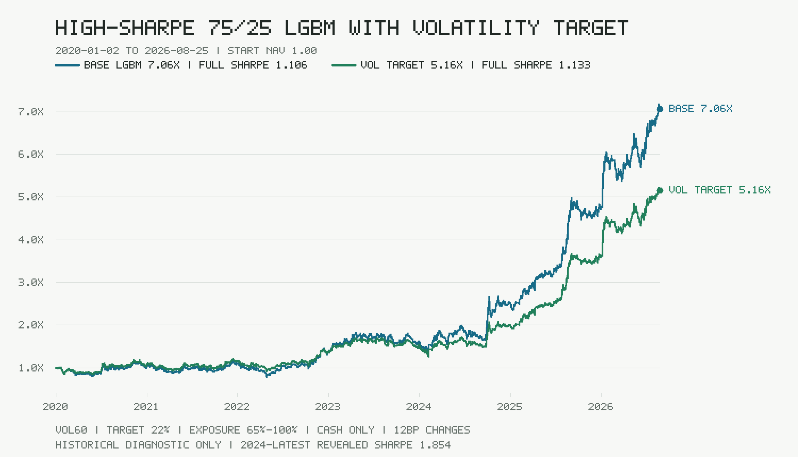

# A-share High-Sharpe 75/25 LGBM Strategy

一套面向 A 股日频数据的 LightGBM 多因子选股研究实现。当前最高夏普候选由冻结选股模型和因果风险仓位层组成：

- 60% LightGBM 横截面排名
- 40% 基础规则排名保护
- LightGBM 内部为 75% Alpha158-lite 与 25% Alpha158+Barra 风险因子模型
- Top5 等权持仓
- 固定每 10 个交易日调仓，周期内不提前换股
- T 日收盘生成信号，T+1 交易日开盘执行
- 回测和模拟盘均使用单边 12bp 成本
- 风险层使用截至 T-1 的60日策略波动率，目标年化波动22%
- 总股票仓位限制在65%-100%，剩余资金持有现金，不使用杠杆或做空
- 聚合仓位每次变化额外计入单边12bp成本



## Important status

这是研究代码和前向模拟盘候选，不是实盘交易系统，也不构成投资建议。

风险参数在2020-2023研究窗口选择。2024-01-02至2026-08-25的揭示诊断中，基础75/25 LGBM的夏普为1.747，波动率目标版本为1.854；后者年化收益61.26%、年化波动27.83%、最大回撤-18.02%。

完整2020-01-02至2026-08-25历史诊断中，基础策略的年化/夏普/最大回撤为35.76%/1.106/-32.07%，波动率目标版本为29.25%/1.133/-25.90%。风险层提升了风险调整收益并降低回撤，但牺牲了绝对年化和期末净值。

“最高夏普”仅表示当前保留候选在上述已揭示诊断窗口中的比较结果，不是对所有策略或未来表现的声明。2024-2026也已被其他研究反复查看，而且数据使用当前Top50股票池历史回填和当前版本复权价格，存在成分股偏差、存续偏差和point-in-time限制，不能视为未见样本或未来收益承诺。

冻结模型的 `strict_no_lookahead_certified` 当前为 `false`。代码已经实现以下局部因果保护，但完整生产级 point-in-time 认证仍要求逐日成分、字段可得日期和时点价格数据：

- 训练标签必须在训练截止日前成熟
- 未来行情扰动不能改变此前的特征或排名
- 模型文件、特征顺序和研究结果使用 SHA-256 校验
- 严格回测模式拒绝当前成分股回填和当前版本前复权数据
- 模拟盘只在下一交易日开盘成交，并单独记录现金、持仓和成本

## Repository layout

```text
app/lgbm_blend_strategy.py             frozen 75/25 model loader and ranker
app/volatility_target_overlay.py       causal 60-session volatility risk budget
app/lgbm_features.py                   Alpha158-lite feature pipeline
app/barra_residual_factors.py          15 Barra-style residual/risk factors
app/adaptive_portfolio.py              fixed-10-session portfolio state machine
app/paper_account.py                   next-open paper execution ledger
scripts/research_lgbm_new_factors_v1.py feature/model selection research
scripts/train_lgbm_new_factors_candidate_v1.py frozen artifact builder
scripts/audit_no_lookahead.py          causal audit entry point
scripts/evaluate_high_sharpe_overlay.py risk-overlay audit and report generator
scripts/render_high_sharpe_overlay_image.py README PNG renderer
data/models/lgbm_new_factors_blend_v1_candidate/ frozen LightGBM artifacts
data/lgbm_new_factors_v1.json          research manifest and limitations
data/lgbm_high_sharpe_overlay_v1.json  risk-overlay metrics and audit contract
tests/                                 focused causality and execution tests
```

## Install

Python 3.9 or newer is required.

```bash
python -m venv .venv
# Windows
.venv\Scripts\python -m pip install -e ".[dev,research]"
# Linux/macOS
.venv/bin/python -m pip install -e ".[dev,research]"
```

## Verify the frozen strategy

```bash
python -m pytest
```

The focused tests verify model hashes and schemas, the 75/25 and 40/60 weight contracts, mature labels, future-perturbation invariance, lagged volatility exposure, exposure bounds, cash allocation, fixed portfolio isolation, next-open execution, lot rounding, transaction costs, and idempotent paper-account updates.

## Load and rank

The ranker accepts a pandas DataFrame containing daily rows with at least `date`, `code`, `name`, `open`, `high`, `low`, `close`, `volume`, `amount`, `turnover`, `pe`, `pb`, `tradestatus`, and `is_st`. For strict research, also provide point-in-time `universe_member` and `available_date` fields.

```python
from datetime import date
from pathlib import Path

from app.lgbm_blend_strategy import LgbmBlendStrategyModel

model = LgbmBlendStrategyModel(
    Path("data/models/lgbm_new_factors_blend_v1_candidate")
)
ranked, audit = model.rank(history, date(2026, 8, 28))
print(ranked[["rank", "code", "name", "score"]].head(5))
print(audit)
```

Do not submit orders at the signal close. The strategy contract requires the generated target portfolio to be executed at the next tradable open with the configured cost and lot constraints.

## Apply the risk budget

The overlay consumes the strategy's realized daily return series, not same-day future returns. `next_session_exposure` uses observations known through the latest completed session and returns a target for the next session.

```python
import pandas as pd

from app.volatility_target_overlay import VolatilityTargetOverlay

overlay = VolatilityTargetOverlay()
next_exposure = overlay.next_session_exposure(realized_strategy_returns)
scaled_weights = overlay.scale_target_weights(
    pd.Series({"stock_a": 0.2, "stock_b": 0.2, "stock_c": 0.2, "stock_d": 0.2, "stock_e": 0.2}),
    next_exposure,
)
cash_weight = 1.0 - float(scaled_weights.sum())
```

The module does not place orders. The caller must apply the scaled stock weights to the next-open execution ledger and retain the residual as cash.

## Reproduce research

Research scripts expect locally supplied market history and may call public market-data endpoints. Raw market data, caches, SQLite paper ledgers, credentials and notification configuration are deliberately excluded from this repository.

```bash
python scripts/research_lgbm_new_factors_v1.py
python scripts/train_lgbm_new_factors_candidate_v1.py
python scripts/audit_no_lookahead.py
python scripts/evaluate_high_sharpe_overlay.py --input /path/to/current_lgbm_curve.csv
python scripts/render_high_sharpe_overlay_image.py
```

Historical model promotion used 2018-2019 for factor/model-structure selection. The risk overlay parameters used 2020-2023, while 2024-2026 is an already-revealed diagnostic. A new forward paper window of at least 126 trading sessions is still required before any production claim.

## Data and security

- `.env`, webhook URLs, API keys, SMTP credentials, databases, caches and logs are ignored.
- The repository contains no raw commercial market dataset.
- Public endpoint availability and adjustment conventions vary by provider; validate them before relying on any result.
- No explicit open-source license is granted by publication alone. The code is publicly inspectable; contact the repository owner before redistribution or commercial reuse.
