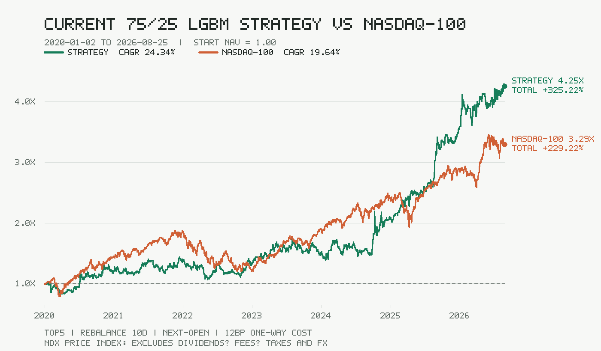

# A-share 75/25 LGBM Strategy

一套面向 A 股日频数据的 LightGBM 多因子选股研究实现。当前冻结候选由两个模型和一层规则保护组成：

- 60% LightGBM 横截面排名
- 40% 基础规则排名保护
- LightGBM 内部为 75% Alpha158-lite 与 25% Alpha158+Barra 风险因子模型
- Top5 等权持仓
- 固定每 10 个交易日调仓，周期内不提前换股
- T 日收盘生成信号，T+1 交易日开盘执行
- 回测和模拟盘均使用单边 12bp 成本



## Important status

这是研究代码和前向模拟盘候选，不是实盘交易系统，也不构成投资建议。

2020-01-02 至 2026-08-25 的历史诊断中，策略日历 CAGR 为 24.34%，最大回撤为 -26.10%；同期 Nasdaq-100 价格指数 CAGR 为 19.64%，最大回撤为 -35.56%。该区间已经揭盲，而且使用了当前 Top50 股票池的历史回填和当前版本复权数据，因此存在成分股偏差、存续偏差和 point-in-time 数据限制。不能把这组结果视为未见样本或未来收益承诺。

冻结模型的 `strict_no_lookahead_certified` 当前为 `false`。代码已经实现以下局部因果保护，但完整生产级 point-in-time 认证仍要求逐日成分、字段可得日期和时点价格数据：

- 训练标签必须在训练截止日前成熟
- 未来行情扰动不能改变此前的特征或排名
- 模型文件、特征顺序和研究结果使用 SHA-256 校验
- 严格回测模式拒绝当前成分股回填和当前版本前复权数据
- 模拟盘只在下一交易日开盘成交，并单独记录现金、持仓和成本

## Repository layout

```text
app/lgbm_blend_strategy.py             frozen 75/25 model loader and ranker
app/lgbm_features.py                   Alpha158-lite feature pipeline
app/barra_residual_factors.py          15 Barra-style residual/risk factors
app/adaptive_portfolio.py              fixed-10-session portfolio state machine
app/paper_account.py                   next-open paper execution ledger
scripts/research_lgbm_new_factors_v1.py feature/model selection research
scripts/train_lgbm_new_factors_candidate_v1.py frozen artifact builder
scripts/audit_no_lookahead.py          causal audit entry point
data/models/lgbm_new_factors_blend_v1_candidate/ frozen LightGBM artifacts
data/lgbm_new_factors_v1.json          research manifest and limitations
tests/                                 focused causality and execution tests
```

## Install

Python 3.9 or newer is required.

```bash
python -m venv .venv
# Windows
.venv\Scripts\python -m pip install -e ".[dev,research]"
# Linux/macOS
.venv/bin/python -m pip install -e ".[dev,research]"
```

## Verify the frozen strategy

```bash
python -m pytest
```

The focused tests verify model hashes and schemas, the 75/25 and 40/60 weight contracts, mature labels, future-perturbation invariance, fixed portfolio isolation, next-open execution, lot rounding, transaction costs, and idempotent paper-account updates.

## Load and rank

The ranker accepts a pandas DataFrame containing daily rows with at least `date`, `code`, `name`, `open`, `high`, `low`, `close`, `volume`, `amount`, `turnover`, `pe`, `pb`, `tradestatus`, and `is_st`. For strict research, also provide point-in-time `universe_member` and `available_date` fields.

```python
from datetime import date
from pathlib import Path

from app.lgbm_blend_strategy import LgbmBlendStrategyModel

model = LgbmBlendStrategyModel(
    Path("data/models/lgbm_new_factors_blend_v1_candidate")
)
ranked, audit = model.rank(history, date(2026, 8, 28))
print(ranked[["rank", "code", "name", "score"]].head(5))
print(audit)
```

Do not submit orders at the signal close. The strategy contract requires the generated target portfolio to be executed at the next tradable open with the configured cost and lot constraints.

## Reproduce research

Research scripts expect locally supplied market history and may call public market-data endpoints. Raw market data, caches, SQLite paper ledgers, credentials and notification configuration are deliberately excluded from this repository.

```bash
python scripts/research_lgbm_new_factors_v1.py
python scripts/train_lgbm_new_factors_candidate_v1.py
python scripts/audit_no_lookahead.py
```

Historical promotion used 2018-2019 for factor/model-structure selection. The 2020-2026 window was used only as an already-revealed veto diagnostic. A new forward paper window of at least 126 trading sessions is still required before any production claim.

## Data and security

- `.env`, webhook URLs, API keys, SMTP credentials, databases, caches and logs are ignored.
- The repository contains no raw commercial market dataset.
- Public endpoint availability and adjustment conventions vary by provider; validate them before relying on any result.
- No explicit open-source license is granted by publication alone. The code is publicly inspectable; contact the repository owner before redistribution or commercial reuse.

